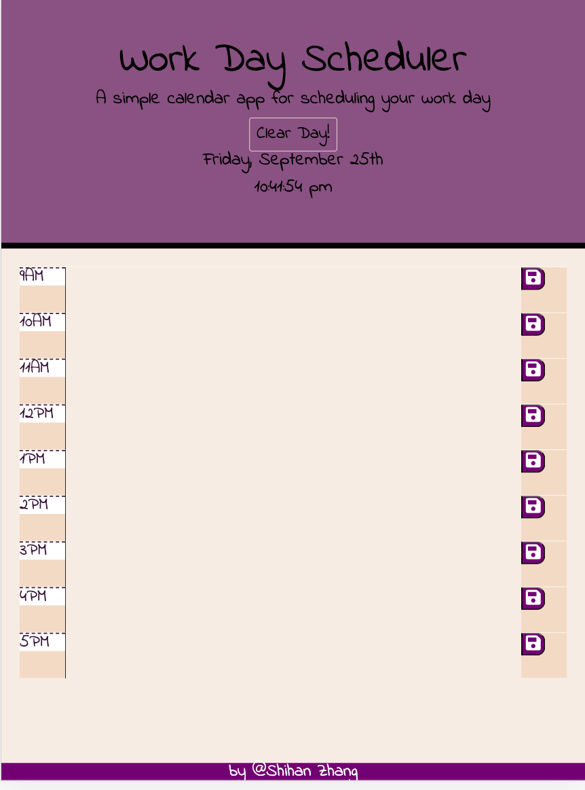
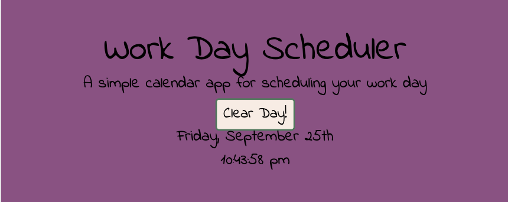

# 05 Third-Party APIs: Work Day Scheduler
* Web application:  https://corazhang.github.io/Work-Day-Scheduler/
* Create a simple calendar application that allows the user to save events for each hour of the day. This app will run in the browser and feature dynamically updated HTML and CSS powered by jQuery.

* [Moment.js](https://momentjs.com/) library needed to work with date and time. 

## What is done
* Display current date and real time on the top of calendar
* Time blocks for standard business hours presented when scrolling (9AM-5PM)
* The time blocks are coded to indicate whether in the past (light shell), future(purple) or present(bisque)
* The user can enter a event when clicking into the timeblocks
* The event is saved to local storage when clicking the save button
* When refreshing the page, the saved events persist if the user does not click clear button
* The clear button deletes local storage. After clicking, then refresh the page to clear screen
* Add sticky footer

## User Story

```
AS AN employee with a busy schedule
I WANT to add important events to a daily planner
SO THAT I can manage my time effectively
```

The following animation demonstrates the application functionality:





